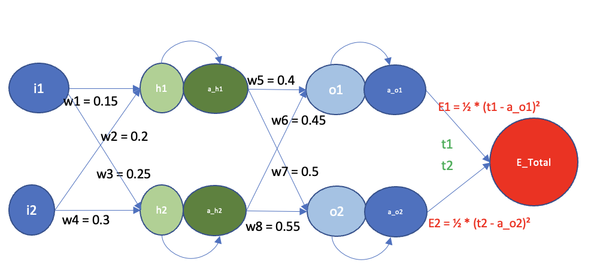

# ERA V1 Session 6 Assignment  - PART 1

This folder contains my submission for the ERA-V1 Session 6 assignment. The file that I used for this assignment is [BackPropagation.xlsx](BackPropagation.xlsx).
My calculations were done in the sheet named ```Experiment```

## Calculation Derivation



Let us consider the above diagram. The network has 1 hidden layer, 1 input layer and 1 output layer.
We have fixed values for i1, i2, t1, and t2:
```
t1 = 0.5
t2 = 0.5
i1 = 0.05
i2 = 0.1
```
We have also been told that the activation function is the sigmoid function.

The given diagram represents a fully connected network. We have fixed inputs and outputs for the network. 
We need to derive the weights and the activation function values for the network such that the error Etotal is minimised.

From the diagram, the following equations can be derived:

```
h1 = w1*i1 + w2*i2
h2 = w3*i1 + w4*i2
a_h1 = sigmoid(h1)
a_h2 = sigmoid(h2)
o1 = w5*a_h1 + w6*a_h2
o2 = w7*a_h1 + w8*a_h2
a_o1 = sigmoid(o1)
a_o2 = sigmoid(o2)
```

The sigmoid activation function is given by:
```
sigmoid(x) = 1/(1 + e^-x)
```

The error function is given by:
```
Etotal = 1/2 * (t1 - a_o1)^2 + 1/2 * (t2 - a_o2)^2
```

The error function is a function of the weights and the activations. We need to find the values of the weights and the activations such that the error function is minimised.
The value of any weight Wx is updated using the following equation:
```
w = w - (LR * dEtotal/dw)
```
where LR is the learning rate and dEtotal/dw is the derivative of the error function with respect to the weight w.

The derivative of the error function with respect to the weight w5 is given by:
```
dEtotal/dw5 = dEtotal/da_o1 * da_o1/do1 * do1/dw5
```
This is arrived at by applying the chain rule.

Now, we need to find the values of dEtotal/da_o1, da_o1/do1 and do1/dw5.
```
dEtotal/da_o1 = 1/2 * 2 * (t1 - a_o1)^1
              = a_o1 - t1
da_o1/do1 = a_o1 * (1 - a_o1)
do1/dw5 = a_h1
```

Therefore,
```
dEtotal/dw5 = (a_o1 - t1) * a_o1 * (1 - a_o1) * a_h1
```

Similarly, we can find the values of dEtotal/dw6, dEtotal/dw7 and dEtotal/dw8.
```
dEtotal/dw6 = (a_o1 - t1) * a_o1 * (1 - a_o1) * a_h2
dEtotal/dw7 = (a_o2 - t2) * a_o2 * (1 - a_o2) * a_h1
dEtotal/dw8 = (a_o2 - t2) * a_o2 * (1 - a_o2) * a_h2
```

Now, we need to find the values of dEtotal/da_h1 and dEtotal/da_h2.
```
dEtotal/da_h1 = dEtotal/da_o1 * da_o1/do1 * do1/da_h1
```
This again is arrived at by applying the chain rule.

Now, we need to find the values of dEtotal/da_o1, da_o1/do1, do1/da_h1
```
dEtotal/da_o1 = 1/2 * 2 * (t1 - a_o1)^1 + 0
              = a_o1 - t1
da_o1/do1 = a_o1 * (1 - a_o1)
do1/da_h1 = w5
dEtotal/da_o2 = 1/2 * 2 * (t2 - a_o2)^1 + 0
              = a_o2 - t2
da_o2/do2 = a_o2 * (1 - a_o2)
do2/da_h1 = w7
```

Therefore,
```
dEtotal/da_h1 = ((a_o1 - t1) * a_o1 * (1 - a_o1) * w5) + ((a_o2 - t2) * a_o2 * (1 - a_o2) * w7)
```

Similarly, we can find the value of dEtotal/da_h2.
```
dEtotal/da_h2 = ((a_o1 - t1) * a_o1 * (1 - a_o1) * w6) + ((a_o2 - t2) * a_o2 * (1 - a_o2) * w8)
```

Now, we need to find the values of dEtotal/dw1, dEtotal/dw2, dEtotal/dw3 and dEtotal/dw4.
```
dEtotal/dw1 = dEtotal/da_h1 * da_h1/dh1 * dh1/dw1
```

Now, we need to find the values of dEtotal/da_h1, da_h1/dh1 and dh1/dw1.
```
dEtotal/da_h1 = ((a_o1 - t1) * a_o1 * (1 - a_o1) * w5) + ((a_o2 - t2) * a_o2 * (1 - a_o2) * w7)
da_h1/dh1 = a_h1 * (1 - a_h1)
dh1/dw1 = i1
```

Therefore,
```
dEtotal/dw1 = (((a_o1 - t1) * a_o1 * (1 - a_o1) * w5) + ((a_o2 - t2) * a_o2 * (1 - a_o2) * w7)) * a_h1 * (1 - a_h1) * i1
```

Similarly, we can find the values of dEtotal/dw2, dEtotal/dw3 and dEtotal/dw4.
```
dEtotal/dw2 = (((a_o1 - t1) * a_o1 * (1 - a_o1) * w5) + ((a_o2 - t2) * a_o2 * (1 - a_o2) * w7)) * a_h1 * (1 - a_h1) * i2
dEtotal/dw3 = (((a_o1 - t1) * a_o1 * (1 - a_o1) * w6) + ((a_o2 - t2) * a_o2 * (1 - a_o2) * w8)) * a_h2 * (1 - a_h2) * i1
dEtotal/dw4 = (((a_o1 - t1) * a_o1 * (1 - a_o1) * w6) + ((a_o2 - t2) * a_o2 * (1 - a_o2) * w8)) * a_h2 * (1 - a_h2) * i2
```

Now, we have the values of all the partial derivatives. We can use these values to update the weights in every iteration.
In the sheet ```Experiment``` in the Excel file, these values are calculated and the weights are updated in every iteration using the formulae derived above.

## Different Learning Rates

Different Learning Rates are used to train the neural network. We find that the neural network converges faster as the learning rate increases. However, if the learning rate is too high, the neural network does not converge at all. This is because the weights are updated by a large amount in every iteration and the neural network does not converge.
Attaching screenshots of the neural network converging for different learning rates.


